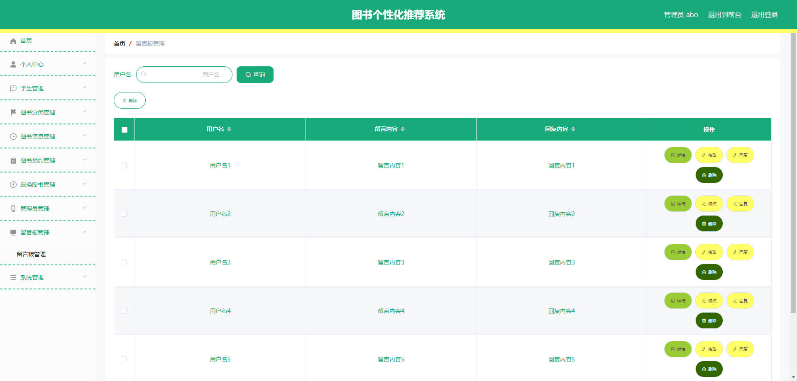

# 基于Springboot的图书个性化推荐系统

## Springboot-0003


## 技术栈

Springboot mybatisplus vue mysql maven


## 数据库表(12张)


## 功能介绍

```properties
管理员
实现功能包括管理员：首页、个人中心、学生管理、图书分类管理、图书信息管理、图书预约管理、退换图书管理、管理员管理、留言板管理、系统管理，学生：首页、个人中心、图书预约管理、退换图书管理、我的收藏管理，前台首页；首页、图书信息、好书推荐、留言反馈、个人中心、后台管理等功能
```


## 图片

### 前台


### 后台





## 访问路径

### 前台

```properties
http://localhost:8080/springbootxs5o6/front/pages/login/login.html

账号 学生1
密码 123456
```

### 后台

```properties
http://localhost:8080/springbootxs5o6/admin/dist/index.html#/login

账号 abo
密码 abo
```


## 功能图


## 文档目录


## 打赏或交流


